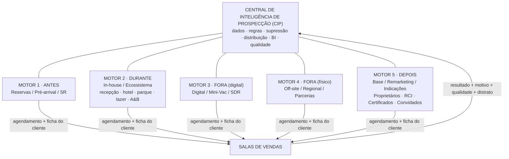
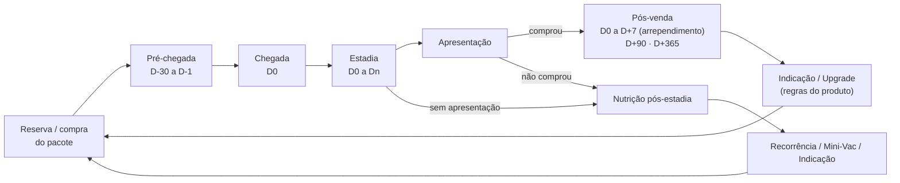
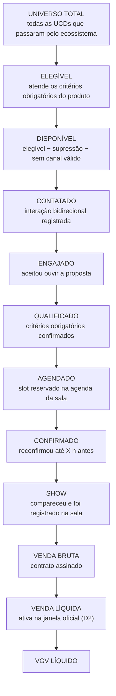
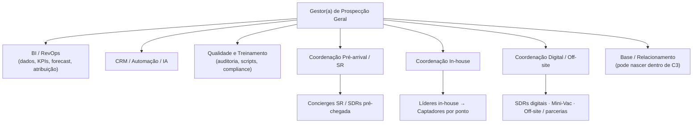
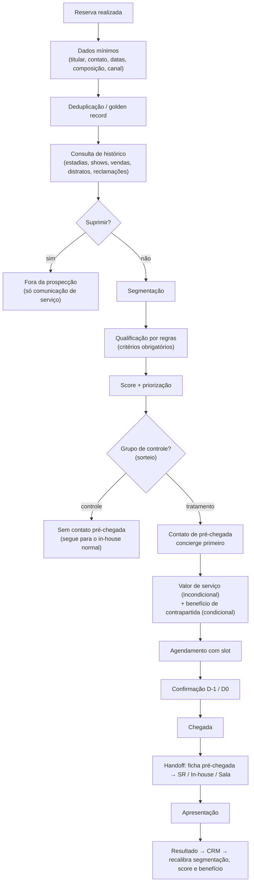
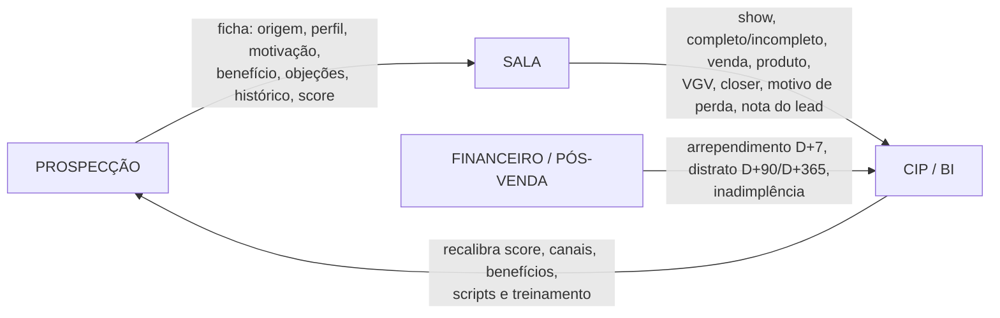

# 01 — Análise crítica e Mapa Mestre da Prospecção Geral

| Item | Status |
|---|---|
| Versão | **v0.1**, 2026-10-06 |
| Base utilizada | (1) briefing de Gustavo de 06/10/2026; (2) código deste repositório (landing page "Seja Sócio Lagoa Lovers"); (3) pesquisa externa com fonte (ver `03-fontes-e-benchmarks.md`) |
| **Documento-base anexo** | **NÃO RECEBIDO.** Não está no repositório (nenhuma branch) nem na pasta da sessão. Quando chegar, gerar a v0.2: reconciliar, reclassificar e listar conflitos com esta versão. |
| Números internos | **Nenhum foi usado.** Todo número interno aparece como DADO PENDENTE ou como variável de fórmula. |

Legenda de classes: **A** regra atual confirmada · **B** dado histórico · **C** diretriz da Diretoria · **D** hipótese de projeto · **E** benchmark externo · **F** pendente de validação.

---

## Sumário executivo

1. **A direção está certa.** Trocar "quantas abordagens" por "qual universo, quanto penetramos e quanto virou venda líquida" é a mudança que mais gera valor nesse tipo de operação. É ela que torna visível o potencial que hoje não aparece em relatório nenhum.
2. **A maior fraqueza não é de estratégia. É de definição e de dado.** Ainda não existem a unidade de contagem do universo, a definição de elegível, o denominador dos 30%, a definição de venda líquida, a chave única do cliente e a regra de propriedade do lead. Sem elas, penetração e conversão não podem ser medidas, podem ser manipuladas e os motores vão competir pelo mesmo cliente.
3. **Penetração e conversão de 30% estão em tensão.** Quando a penetração cresce, entram em sala clientes de menor propensão e a conversão média tende a cair. A métrica que resolve esse conflito é **VGV líquido por domicílio elegível**, decomposta em quatro alavancas (seção A). Recomendo que ela seja a métrica-norte (D).
4. **O pré-arrival é a maior alavanca e também o maior risco.** É a maior alavanca porque o Grupo controla o fluxo de hóspedes, coisa que incorporadoras sem hotel não têm. É o maior risco por três motivos: LGPD (finalidade dos dados da reserva e possível compartilhamento entre CNPJs), experiência do hóspede e incrementalidade. O piloto precisa de **grupo de controle** para provar que gera venda nova e não apenas antecipa venda que o in-house já faria.
5. **O contexto jurídico do mercado exige "venda líquida" como regra, não como discurso.** Há litígios crescentes de multipropriedade em Caldas Novas, aplicação do art. 49 do CDC a contratações em ambiente de lazer e debate no STJ sobre a retenção no distrato (fontes na seção T).
6. **Nos primeiros 30 dias:** definições oficiais, baseline de 12 meses, inventário de sistemas e dados, mapeamento LGPD com o DPO e desenho do piloto. **Nenhum headcount antes do baseline.**

---

# PARTE 1 — ANÁLISE CRÍTICA

## 1.1 Pontos fortes da proposta

| # | Ponto forte | Por que importa | Classe |
|---|---|---|---|
| F1 | Gestão por **universo e penetração** | Expõe o potencial não capturado e muda a conversa de "esforço" para "cobertura do mercado cativo". | C |
| F2 | **Dados de reserva usados antes da chegada** | Explora a vantagem estrutural do ecossistema integrado (hotel + parque + multipropriedade). Operadores internacionais ligados a marcas hoteleiras usam a afinidade do hóspede como principal fonte de tours (E: a HGV declara marketing direto a pessoas com capacidade financeira, perfil de viajante frequente e afinidade com a marca). | C |
| F3 | **Brindes separados por espaço/canal** | É o pré-requisito para calcular custo de benefício por show e por venda líquida. Hoje o brinde tende a ser um custo de aquisição oculto. | C |
| F4 | **Central de inteligência** em vez de departamentos isolados | Evita canibalização, dupla abordagem e dupla comissão sobre o mesmo cliente. | C/D |
| F5 | **Venda líquida e distrato** no centro | Está alinhado ao risco jurídico atual do setor (seção T). | C |
| F6 | **Closed loop** com a sala | É o único caminho para calibrar score, benefícios e canais com resultado real. | D |
| F7 | **Dimensionamento de trás para frente** | Impede o headcount "por feeling" e amarra time à meta. | D |

## 1.2 Lacunas

| # | Lacuna | Consequência se não for resolvida | Como fechar | Quem decide |
|---|---|---|---|---|
| L1 | **Unidade de contagem do universo** (pessoa? reserva? UH? família? casal?) | Penetração distorcida. Uma família de 4 pessoas conta como 4 e derruba artificialmente a taxa. | Adotar a **UCD — Unidade Comercial de Decisão** (grupo familiar ou casal decisor). Proxy operacional: reserva deduplicada pelo titular (hotel), transação de ingresso (parque) e lead deduplicado (digital). | Diretoria + BI (D3) |
| L2 | **Definição de elegível** | Cada área usa um critério e os números não fecham entre si. | Critérios obrigatórios formais por produto (idade, decisores, proprietário ou não, residência, renda declarada se aplicável). DADO PENDENTE: critérios atuais da sala. | Diretoria + Salas (D1) |
| L3 | **Denominador e janela dos 30%** | Meta inaplicável ou manipulável (ex.: excluir shows "incompletos" para inflar a taxa). | Ver decisão D1. Medir sempre bruta e líquida, por origem. | Diretoria (D1) |
| L4 | **Definição de venda líquida** | Sem ela, "venda líquida" vira o número que for conveniente. | Três cortes de coorte: **D+7** (pós-arrependimento), **D+90** e **D+365** (distrato/inadimplência). | Diretoria + Financeiro (D2) |
| L5 | **Chave única do cliente** (resolução de identidade entre PMS, bilheteria, CRM de vendas, Mini-Vac, leads) | Sem deduplicação, sem histórico único e sem bloqueio confiável de convertidos e opt-outs. | Golden record com regras de match: CPF quando legítimo, telefone E.164, e-mail normalizado, nome + data de nascimento. | BI/CRM + TI |
| L6 | **Propriedade do lead, atribuição e comissão** | É o maior risco organizacional. Comissão define comportamento: motores vão disputar o cliente e registrar contatos "para marcar território". | Política de distribuição com dono temporário (lock com expiração), regra de atribuição e câmara de disputa (seção B). | Diretoria (D5) |
| L7 | **Capacidade das salas** | Mais shows sem slots e closers suficientes geram espera, apresentação incompleta, queda de conversão e reclamação. | Capacidade = mesas × slots/dia × ocupação-alvo, por sala e por horário. DADO PENDENTE. | Salas + Prospecção |
| L8 | **Lista de supressão** | Abordar quem não deve ser abordado: opt-out, reclamação ou processo, cliente em distrato, proprietário fora da regra, funcionário, menor. | Supressão central sincronizada com todos os canais, consultada antes de cada abordagem. | CIP + Jurídico/DPO |
| L9 | **Custeio do benefício** (custo marginal, preço de tabela ou custo de oportunidade) | Um ingresso ou diária "grátis" custa muito diferente em dia de baixa e em dia de lotação. O ROI fica errado nos dois sentidos. | Registrar três valores por benefício (seção N). | Financeiro (D6) |
| L10 | **Guardrail de experiência** | Abordagem excessiva derruba o NPS e a reputação online do hotel e do parque, que são o negócio-mãe. | Teto de contatos por UCD por estadia e NPS comparado entre abordados e não abordados. | Diretoria (D8) |
| L11 | **Incrementalidade** | Atribuir ao pré-arrival vendas que o in-house faria de qualquer forma infla o ROI. | Grupo de controle aleatório no piloto (seção G). | BI/RevOps |
| L12 | **Portfólio e regra de produto** | Não se sabe qual produto vai para qual público. O repositório mostra "Sócio Lagoa Lovers"; a imprensa cita cotas do Lagoa Eco Towers. | Matriz produto × público × sala. DADO PENDENTE. | Diretoria + Produto |
| L13 | **Estado atual da tecnologia** | Não dá para desenhar automação sem saber qual CRM, PMS e telefonia existem e se há integração. | Inventário de sistemas (seção M). | TI + CIP |
| L14 | **Baseline** | Toda meta é chute sem 12 meses de histórico do funil. | Coleta de dados (seção final). | Gustavo |

## 1.3 Riscos

Probabilidade e impacto são minha avaliação qualitativa (D), não dado.

| # | Risco | Prob. | Impacto | Sinal de alerta (KPI) | Mitigação |
|---|---|---|---|---|---|
| R1 | **LGPD: uso de dados da reserva fora da finalidade** ou compartilhamento entre empresas do grupo sem base legal | Média | Alto | Reclamações de titular, pedidos de exclusão, notificação da ANPD | Mapeamento de tratamentos, teste de balanceamento (LIA), aviso de privacidade na reserva, opt-out em todo contato. **VALIDAR COM JURÍDICO/DPO.** |
| R2 | **Plataforma: bloqueio do número de WhatsApp** por disparo sem opt-in | Média | Alto | Queda da *quality rating* e bloqueios reportados | Somente templates aprovados, opt-in registrado, WhatsApp oficial via BSP, nunca o celular pessoal do captador. |
| R3 | **Telemarketing sem prefixo 0303**, se a ligação de pré-chegada com oferta for enquadrada como telemarketing ativo | Média | Médio | Bloqueios e reclamações | Avaliar o enquadramento. **VALIDAR COM JURÍDICO.** |
| R4 | **CDC: arrependimento (art. 49) e práticas abusivas** | Alta no mercado | Alto | Arrependimento D+7, reclamações em Procon e Reclame Aqui, ações judiciais | Transparência na abordagem ("é uma apresentação comercial de X minutos"), auditoria de promessas, welcome call, remuneração sobre venda líquida. |
| R5 | **Canibalização entre motores** e dupla comissão | Alta | Médio | Mesmo cliente com dois "donos", disputas, contatos duplicados | Política de propriedade do lead e consulta antes de abordar. |
| R6 | **Inflação de indicadores** (contatos fantasmas, agendamento sem confirmação) | Alta | Médio | Show rate caindo enquanto agendamentos sobem; contatos sem evidência | Evidência sistêmica de contato (log de ligação ou mensagem), auditoria amostral, nunca remunerar só contato. |
| R7 | **Brinde como custo oculto** e "turista de brinde" | Alta | Médio | Custo de benefício por venda líquida subindo; show alto com conversão baixa | Política de benefícios, voucher nominal, alçadas, ROI por benefício. |
| R8 | **Degradação da experiência** do hóspede e do visitante | Média | Alto | NPS de abordados vs não abordados, menções a "abordagem" em reviews | Teto de pressão de contato e convite contextual em vez de abordagem de rua. |
| R9 | **Sala sobrecarregada** | Média | Médio | Espera > X min, apresentações incompletas, ocupação da sala > Y% | Agenda de slots compartilhada e priorização por score quando houver escassez. |
| R10 | **Qualidade de dado ruim** (OTA sem telefone, cadastro incompleto) | Alta | Alto | Cobertura de dados por canal de reserva | Métrica de completude por canal e ações na reserva direta. |
| R11 | **Resistência organizacional** (recepção, reservas e parque respondem a outras diretorias) | Alta | Médio | SLAs de handoff descumpridos | RACI aprovado pela Diretoria, metas compartilhadas e incentivo validado com RH e Jurídico trabalhista. |
| R12 | **Excesso de engenharia** (score e IA antes de existir dado) | Média | Médio | Projeto de tecnologia sem KPI de negócio | Ondas: regras simples, depois modelo estatístico, depois IA (seção S). |

## 1.4 Oportunidades

| # | Oportunidade | Lógica | Dado para dimensionar | Como testar |
|---|---|---|---|---|
| O1 | **Pré-arrival com agenda reservada** | Cliente chega conhecido, com benefício definido e horário pré-reservado. Reduz abordagem de rua e aumenta o show. | Reservas futuras por canal, antecedência e completude de contato | Piloto em uma UN com controle aleatório |
| O2 | **Hóspede recorrente** | Quem volta a Caldas Novas já demonstra o comportamento que a multipropriedade monetiza (viajar ao mesmo destino com frequência). | Frequência de estadias por titular nos últimos 24–36 meses | Comparar conversão de recorrentes e de primeira estadia |
| O3 | **Visitante day-use do parque** | É um universo grande, hoje provavelmente fora do funil por falta de identificação. | Volume de ingressos e % com contato identificado | Captura com opt-in na compra online e convite para Mini-Vac |
| O4 | **Pipeline de quem não fechou** (show sem venda e engajado sem agenda) | Nutrição pós-estadia com nova experiência. O Mini-Vac pode ser o produto de reentrada. | Volume de shows sem venda por mês e motivos de perda | Cadência pós-estadia com controle |
| O5 | **Proprietários: upgrade e indicação** (dentro das regras do produto) | Nos EUA, a maior parte das vendas vem de quem já é proprietário (E: HGV, 70% das contract sales de 2023). | Base de proprietários, regras do produto, histórico de upgrades | Programa de indicação pago sobre venda líquida |
| O6 | **Benefícios com custo de oportunidade baixo** | Upgrade, late check-out e experiências em dias de baixa ocupação custam quase nada e têm alto valor percebido. | Ocupação diária por UN | A/B de benefício por faixa de ocupação |
| O7 | **Lookalike de compradores líquidos** | Usar o perfil de quem comprou e permaneceu para priorizar o universo. | 12–24 meses de vendas com status de permanência | Score v0 por regras, validado em coorte posterior |
| O8 | **IA em conversas** | Resumo automático, QA de promessas e extração de objeções. Ganho rápido e baixo risco. | Gravações e conversas com base legal | Piloto de 30 dias com amostra auditada |
| O9 | **Mini-Vac como "segunda chance"** do in-house | Quem não pôde ver a apresentação na estadia volta com pacote. Benchmark: a HGV acompanha "package activations" como pipeline de tours (E). | Estoque de pacotes, ativação e expiração | Coorte de pacotes por origem |

## 1.5 Decisões que a Diretoria precisará tomar

| # | Decisão | Opções | Recomendação (D) | Quando |
|---|---|---|---|---|
| **D1** | Denominador oficial dos 30% | (a) vendas ÷ apresentações realizadas; (b) vendas líquidas ÷ apresentações; (c) vendas ÷ casais/UCDs apresentados; (d) só apresentações completas | Numerador: **vendas brutas e líquidas, as duas**. Denominador: **UCDs com show registrado** (todo show conta, completo ou não). Meta **por segmento de origem** (novo comprador vs proprietário/upgrade vs Mini-Vac vs in-house). Excluir shows incompletos do denominador cria incentivo a classificar shows ruins como "incompletos". | Dia 30 |
| **D2** | Janela da venda líquida | D+7, D+30, D+90, 1ª parcela compensada, D+365 | Acompanhar **D+7, D+90 e D+365**. Remuneração variável pela visão que o Financeiro conseguir apurar com segurança (provavelmente D+7 com clawback até D+90). **VALIDAR COM JURÍDICO TRABALHISTA.** | Dia 30 |
| **D3** | Unidade de contagem do universo | Pessoa, reserva, UH, UCD | **UCD**, com pessoa como visão auxiliar | Dia 30 |
| **D4** | Autoridade da Prospecção Geral sobre áreas de outras diretorias (reservas, recepção, parque, A&B) | Comando direto, matriz com SLA, apenas consultiva | **Matriz com SLA e RACI** aprovados pela Diretoria, com metas compartilhadas | Dia 30 |
| **D5** | Propriedade do lead e atribuição para remuneração | First touch, last touch, "quem agendou", divisão | **"Quem agendou o show válido"** é o dono para remuneração. Contribuição de outros motores é reconhecida por pool de time. Lock com expiração. | Dia 45 |
| **D6** | Orçamento e custeio de benefícios | Centro de custo único da Prospecção ou rateio; custo marginal, tabela ou oportunidade | **Centro de custo único da Prospecção** (transferência interna a custo definido pelo Financeiro) e três valores registrados por benefício | Dia 45 |
| **D7** | Quais proprietários e cotistas podem ser abordados, para quais produtos | — | DADO PENDENTE (regras de cada produto) | Dia 30 |
| **D8** | Teto de pressão de contato por UCD e por estadia | — | Definir após o baseline. Hipótese inicial a testar: 1 contato remoto pré-chegada + 1 convite presencial + 1 lembrete | Dia 60 |
| **D9** | Sistema de registro único (CRM) | Manter o atual, evoluir ou trocar | Depende do inventário (seção R) | Dia 60 |
| **D10** | Base legal, aviso de privacidade e termos de reserva | — | Conduzido pelo DPO. **VALIDAR COM JURÍDICO/DPO.** | Antes do piloto |
| **D11** | Remuneração variável | Por contato, agendamento, show, venda bruta ou venda líquida | **Composta**: show válido + venda líquida + gatilho de qualidade. Nunca por contato. | Dia 75 |
| **D12** | UN e empreendimento do piloto | — | Escolher a UN com melhor completude de dados de reserva e sala com capacidade ociosa | Dia 30 |
| **D13** | Meta de penetração | — | **Só após o baseline**: meta = baseline + ganho testado no piloto | Dia 90 |

---

# PARTE 2 — MAPA MESTRE DO PROJETO DE PROSPECÇÃO GERAL

## A. Visão estratégica

**Missão proposta (D):** transformar todo o fluxo de pessoas do ecossistema Lagoa Quente em oportunidades comerciais qualificadas, preservando a experiência do hóspede e gerando venda líquida rentável e permanente.

**Métrica-norte proposta (D): VGV líquido por UCD elegível.** Ela se decompõe em quatro alavancas, cada uma com um dono:

```
VGV líquido = Elegíveis × Penetração em sala × Conversão líquida × Ticket médio líquido
               (Shows ÷ Elegíveis)  (Vendas líq. ÷ Shows)  (VGV líq. ÷ Vendas líq.)
```

| Alavanca | Dono principal | Corresponsável |
|---|---|---|
| Elegíveis (tamanho e qualidade do universo) | Hotelaria/Marketing (ocupação) + CIP (elegibilidade, cobertura de dados) | Reservas |
| Penetração em sala | **Prospecção Geral** | SR, In-house, Digital, Off-site |
| Conversão líquida | Salas de Vendas | **Prospecção** (qualidade do lead, por origem) |
| Ticket líquido | Salas / Produto / Pricing | — |

**Por que essa métrica (D):** ela resolve a tensão entre penetração e conversão. Levar mais gente à sala sempre derruba a conversão média em algum ponto. A pergunta certa é se o VGV líquido por elegível subiu e se o custo marginal compensou.

**Regra econômica de convite (D):** convidar uma UCD para a sala se

```
P(venda líquida | perfil) × Ticket líquido × Margem de contribuição %  >  Custo marginal do show
```

O custo marginal do show soma benefício, tempo da equipe e custo de oportunidade do slot. Quando a sala está cheia, o slot custa o valor esperado do próximo melhor lead. Essa regra é a base econômica do score e da priorização.

**Princípios operacionais (D):**
1. Um cliente, um histórico, um dono por vez, uma próxima melhor ação.
2. Entregar valor antes de pedir tempo, com transparência de que existe uma apresentação comercial.
3. Benefício com dono, custo e retorno medido.
4. Venda líquida acima de venda bruta.
5. Dado só com base legal e finalidade definida.
6. Testar antes de escalar, sempre com grupo de controle quando for possível.

## B. Arquitetura dos canais

### B.1 Estrutura proposta: um núcleo e cinco motores organizados pelo momento do cliente (D)

Proponho manter os cinco motores, mas defini-los pelo **momento da jornada** em que o cliente está, e não por departamento. Assim, cada cliente tem um único dono em cada momento.



### B.2 Mapa de públicos (os 22 canais da Diretoria)

Os campos "pode abordar" e "base legal" são hipóteses (D/F). **VALIDAR COM JURÍDICO/DPO.**

| Público / canal | Sistema-fonte provável | Motor dono | Momento | Abordagem padrão (hipótese) | Observação |
|---|---|---|---|---|---|
| Reservas futuras (diretas) | PMS / motor de reservas | M1 | Antes | Concierge de pré-chegada + convite com horário | Maior completude de dados esperada |
| Reservas via OTA / agência | PMS / channel manager | M1 → M2 | Antes/Durante | Se não houver contato válido, identificar no check-in | E-mails mascarados e telefone ausente são comuns |
| Pacotes / grupos / eventos | PMS / comercial | M1 | Antes | Regra específica por contrato do grupo | Pode haver restrição contratual |
| Recepção / check-in | PMS | M2 | Durante | Recepção **não vende**: identifica, entrega o convite e encaminha | Evita conflito de papel |
| Hotel / lazer / recreação | PMS / app | M2 | Durante | Convite contextual em pontos com agenda | Respeitar o teto de pressão |
| Parque (hóspede) | Bilheteria + PMS | M2 | Durante | Convite em ponto de experiência | Cruzar com o PMS para não duplicar |
| Parque (day-use) | Bilheteria | M2 / M3 | Durante/Depois | Opt-in na compra, convite para Mini-Vac | Universo grande e pouco identificado |
| A&B | PDV | M2 | Durante | Somente com estratégia definida (ex.: café com apresentação) | "Quando estrategicamente aplicável" |
| Lagoa Experience / Mini-Vac | Sistema Mini-Vac | M3 | Antes/Durante | Dono do pacote até o show | Com compromisso contratual de apresentação |
| Leads digitais | Landing / Ads / WhatsApp | M3 | Fora | SDR com SLA de primeiro contato | Ver achados do repositório (seção J) |
| Off-site / regional | CRM | M4 | Fora | Agendar visita ou Mini-Vac. **Evitar fechamento fora do estabelecimento** (art. 49) | **VALIDAR COM JURÍDICO** |
| Parcerias | CRM | M4 | Fora | Benefício via parceiro com opt-in do parceiro | Contrato com cláusula LGPD |
| Base de clientes (ex-hóspedes) | PMS histórico / CRM | M5 | Depois | Remarketing com opt-in ou legítimo interesse | LIA por campanha |
| Convidados | CRM | M5 | Depois | Regra específica do programa | DADO PENDENTE |
| Proprietários / cotistas | ERP de contratos | M5 | Depois | Upgrade e indicação **dentro das regras do produto** | DADO PENDENTE (D7) |
| RCI | RCI / PMS | M2 / M5 | Durante | Regra a definir com a RCI e o produto | Verificar restrições contratuais |
| Certificados | Sistema de certificados | M5 / M3 | Antes/Durante | Fluxo similar ao Mini-Vac | DADO PENDENTE |
| Indicações | CRM | M5 | Depois | Primeiro contato informa quem indicou e oferece opt-out | O indicado não forneceu os próprios dados |
| Remarketing | Ads / CRM | M5 / M3 | Depois | Públicos de remarketing com consentimento de cookies | Política de cookies do site |
| Captação regional | CRM | M4 | Fora | — | — |
| Outros canais | — | Decisão da CIP | — | Só entram após teste com KPI | — |

### B.3 Regras de propriedade e prioridade (proposta de "constituição da distribuição", D)

1. **Supressão vence tudo.** Opt-out, reclamação ou processo, distrato em curso, cliente convertido no período de bloqueio, funcionário e proprietário fora da regra não são abordados.
2. **Agendamento válido tem dono.** Quem agendou é dono até o show ou até a expiração (horário do slot + tolerância; DADO PENDENTE).
3. **Reserva futura é do M1** até o check-in. Se não houver agendamento no check-in, o dono passa automaticamente ao M2.
4. **Pacote Mini-Vac ou certificado é do M3** do momento da venda do pacote até o show. O M2 não aborda; apenas reconfirma.
5. **Proprietário é do M5** (relacionamento), segundo as regras de cada produto.
6. **Show sem venda** volta para o M5 (nutrição) depois do check-out, com período de quarentena (DADO PENDENTE).
7. **Lock com expiração.** Todo dono temporário perde o lead se não houver interação registrada dentro do SLA.
8. **Consulta antes de abordar.** Nenhum agente aborda sem consultar o status do cliente (app ou CRM). Abordagem sem consulta não gera atribuição.
9. **Disputa** vai para a câmara semanal da CIP, com decisão registrada. O histórico de decisões vira jurisprudência interna.

## C. Jornada do cliente



| Etapa | Objetivo | Pontos de contato | Dono | Dado capturado | KPI | Risco |
|---|---|---|---|---|---|---|
| Reserva | Capturar contato válido e base legal | Motor de reservas, central, OTA | Reservas (corresponsável) | Contato, composição do grupo, finalidade da viagem, opt-ins | Cobertura de dados | Formulário longo derruba a conversão da reserva |
| Pré-chegada | Servir e, quando fizer sentido, agendar | WhatsApp, telefone, e-mail | M1 / SR | Interesse, perfil, disponibilidade, benefício escolhido | Taxa de contato, agendamento antecipado | Invasividade, LGPD |
| Chegada | Reconhecer, confirmar e entregar o convite | Recepção | M2 (recepção roteia) | Confirmação, ajustes | Confirmação no check-in | Fila no check-in |
| Estadia | Experiência e convite contextual | Hotel, parque, lazer | M2 | Interações, aceite | Penetração in-house | Pressão de contato |
| Apresentação | Apresentar com clareza e transparência | Sala | Salas | Show, completude, resultado, motivo de perda | Conversão bruta e líquida, VPG | Promessa excessiva |
| Pós-venda | Reduzir arrependimento e distrato | Welcome call, onboarding | Pós-venda / Qualidade | Entendimento do contrato | Arrependimento D+7, distrato D+90 | — |
| Nutrição | Reativar quem não comprou | E-mail, WhatsApp com opt-in, remarketing | M5 | Engajamento | Reagendamento, Mini-Vac | Opt-out |

## D. Funil

### D.1 Definição operacional de cada etapa (proposta, D; a unidade é a UCD)



**Regras de registro (D):**
- "Contatado" exige evidência sistêmica: log de ligação com duração, mensagem respondida ou registro presencial com geolocalização ou QR. Tentativa sem resposta é **tentativa**, não contato.
- "Show" é registrado pela **sala** (check-in na sala), nunca pela prospecção.
- Toda perda entre etapas tem **motivo codificado** (lista fechada, revisada a cada trimestre).

### D.2 Método de diagnóstico de gargalo (D)

O gargalo **não** é a etapa com a maior queda percentual. É a etapa onde se perde mais **VGV líquido esperado**:

```
VGV em jogo na etapa k = (Entradas_k × (Taxa_ref_k − Taxa_atual_k)) × Conversões a jusante_k × Ticket líquido
```

`Taxa_ref` é a melhor referência **interna** (melhor quartil de UN, período ou equipe), não o benchmark externo. Ordenar as etapas pelo VGV em jogo define a prioridade de ação.

### D.3 Coortes

- **Pré-arrival e in-house:** coorte pela **data de check-in** (o resultado de uma reserva feita em janeiro para março pertence a março).
- **Digital:** coorte pela **data de entrada do lead**.
- **Venda líquida e distrato:** coorte pela **data da venda bruta**.

## E. Penetração

### E.1 Família de indicadores

As cinco primeiras definições vêm do briefing; as demais são adições propostas (D).

| Indicador | Fórmula |
|---|---|
| Penetração bruta | Contatados ÷ Universo disponível |
| Penetração elegível | Contatados ÷ Elegíveis |
| Penetração qualificada | Qualificados ÷ Elegíveis |
| Penetração em sala | Shows ÷ Elegíveis |
| Penetração em vendas | Vendas líquidas ÷ Elegíveis |
| *Penetração total* | Contatados ÷ Universo total |
| *Cobertura de dados* | Elegíveis com contato válido e base legal ÷ Elegíveis |
| *Taxa de supressão* | Suprimidos ÷ Elegíveis |
| *Penetração de agenda* | Agendados ÷ Elegíveis |
| *VGV líquido por elegível* | VGV líquido ÷ Elegíveis (**métrica-norte**) |
| *Pressão de contato* | Contatos ÷ UCD contatada (por estadia) |
| *Penetração incremental* | (Taxa de show do grupo tratado − Taxa do grupo controle) × Tratados |
| *Sobreposição entre motores* | UCDs com contato de 2+ motores ÷ UCDs contatadas |

### E.2 Matriz de penetração (modelo de planilha)

Linhas: UN / empreendimento / origem. Colunas:

| UN / origem | Universo | Elegível | Disponível | Contatado | Qualificado | Agendado | Show | Venda bruta | Venda líquida | VGV líquido | Pen. elegível | Pen. em sala | Pen. em vendas | VGV líq./elegível | VGV em jogo |
|---|---|---|---|---|---|---|---|---|---|---|---|---|---|---|---|
| (por UN) | DADO PENDENTE | … | … | … | … | … | … | … | … | … | fórmula | fórmula | fórmula | fórmula | fórmula D.2 |

Recortes obrigatórios: empreendimento, UN, origem, canal, período, dia da semana, horário, público, captador, SDR, líder, sala, produto, benefício e campanha.

### E.3 "Onde está o potencial que ainda não capturamos?" (D)

```
Potencial não capturado (UN i) = Σ etapas  VGV em jogo(i, k)
```

Comparar cada UN contra a melhor referência interna, ordenar e atacar o maior valor. Essa é a resposta diária à segunda pergunta-norte.

## F. Estrutura de equipe

### F.1 Organograma funcional (hipótese D; não é headcount)



| Função | Missão | KPIs principais |
|---|---|---|
| Gestor(a) de Prospecção Geral | Maximizar o VGV líquido por elegível dentro dos guardrails | Métrica-norte, CAC, distrato por origem, NPS dos abordados |
| BI / RevOps | Medir, atribuir, projetar e encontrar o gap | Qualidade do dado, pontualidade do dashboard, acurácia do forecast |
| CRM / Automação / IA | Garantir que o sistema execute as regras | SLA de integração, % de leads distribuídos automaticamente |
| Qualidade e Treinamento | Garantir venda certa e abordagem transparente | Arrependimento D+7, auditorias, reclamações por 1.000 abordagens |
| Coordenação Pré-arrival / SR | Converter reserva futura em agenda qualificada | Cobertura, contato, agendamento antecipado, show, lift vs controle |
| Coordenação In-house | Cobrir quem chegou sem agenda | Penetração in-house, show, pressão de contato, NPS |
| Coordenação Digital / Off-site | Gerar demanda fora do ecossistema | Custo por show, conversão líquida, VGV por pacote |

### F.2 Modelo de dimensionamento (fórmulas; os números virão do baseline)

Variáveis (todas são DADO PENDENTE por motor e por UN):
`VL` meta de vendas líquidas · `p` permanência (líquida ÷ bruta) · `c` conversão bruta da sala · `s` show rate · `a` taxa de agendamento · `q` taxa de qualificação · `k` taxa de contato · `t₁` minutos por tentativa · `t₂` minutos por conversa · `t₃` minutos por agendamento e confirmação · `H` horas contratuais por FTE no mês · `u` % de tempo produtivo · `sh` shrinkage (férias + absenteísmo + treinamento + reuniões + pausas).

```
Vendas brutas    = VL ÷ p
Shows            = Vendas brutas ÷ c
Agendamentos     = Shows ÷ s
Qualificados     = Agendamentos ÷ a
Contatos         = Qualificados ÷ q
Tentativas       = Contatos ÷ k
Horas            = (Tentativas × t₁ + Contatos × t₂ + Agendamentos × t₃) ÷ 60
FTE produtivo    = Horas ÷ (H × u)
FTE de escala    = FTE produtivo ÷ (1 − sh)
```

**Três testes de viabilidade, antes de falar em headcount:**
1. **Universo:** `Contatos ≤ Disponíveis × contatos máximos por UCD`. Se falhar, o problema é universo (abrir novas fontes), não pessoas.
2. **Sala:** `Shows ≤ Mesas × Slots por dia × Dias × Ocupação-alvo`. Se falhar, o gargalo é a sala.
3. **Cobertura in-house:** o in-house é dimensionado pelo **maior** entre a carga de trabalho e a cobertura mínima de pontos × horários (curva de chegadas por hora, picos de check-in). `FTE in-house = max(FTE por carga, FTE por cobertura de escala)`.

**Sazonalidade (D):** projetar o universo mês a mês (ocupação prevista × UHs + previsão do parque). Dimensionar o time-base para um mês típico e cobrir picos com flexibilidade (realocação entre motores, banco de horas, temporários). **VALIDAR COM RH/Jurídico trabalhista.**

## G. Pré-arrival

### G.1 Fluxo



### G.2 Detalhamento (O quê / Como / Quem / Quando / Dado / KPI / Risco)

| Passo | O que fazer | Como | Quem | Quando (hipótese D, testar) | Dado | KPI | Risco |
|---|---|---|---|---|---|---|---|
| Dados mínimos | Garantir contato válido e opt-ins na reserva | Campos obrigatórios e opcionais no motor de reservas e na central; checkbox **granular** de comunicações | Reservas + TI + DPO | Na reserva | Telefone E.164, e-mail, adultos/crianças, canal | Cobertura de dados por canal | Formulário longo derruba a conversão da reserva |
| Deduplicação | Unificar o titular | Match determinístico (CPF/telefone/e-mail) | CIP (automático) | Até X h após a reserva | Chaves de identidade | Taxa de duplicidade | Falsos positivos |
| Histórico | Saber quem é | Cruzar PMS, CRM de vendas, ERP de contratos, Mini-Vac | CIP | Automático | Shows, vendas, distratos, reclamações | — | Bases desconectadas |
| Supressão | Não abordar quem não deve | Lista central | CIP + DPO | Automático, antes de qualquer contato | Opt-out, processos, regras de produto | Taxa de supressão | Lista desatualizada |
| Segmentação | Agrupar por contexto | Canal da reserva, antecedência, duração, composição familiar, origem geográfica, recorrência | BI | Diário | Dados da reserva | Conversão por segmento | Segmentos sem volume |
| Qualificação | Aplicar critérios obrigatórios | Regras no CRM | CIP | Automático | Critérios do produto (DADO PENDENTE) | % qualificados | Critério desatualizado |
| Score e priorização | Ordenar a fila | Score v0 por regras (seção L.5) | BI | Diário | Histórico + reserva | Conversão por faixa de score | Viés do score |
| Controle | Medir a incrementalidade | Sorteio aleatório de X% dos elegíveis | BI | Na entrada da fila | — | Lift tratado vs controle | Pressão para "não desperdiçar" leads |
| Contato | Servir primeiro, convidar depois | Mensagem de concierge (horários, dicas, reservas) e convite transparente | Concierge SR | Janelas a testar: D-7, D-3, D-1 | Interações | Contato, engajamento | Invasividade; WhatsApp sem opt-in |
| Benefício | Contrapartida clara | Catálogo da seção N | Concierge (alçada 1) | No agendamento | Benefício vinculado | Custo por show | Brinde sem controle |
| Agendamento | Reservar o slot | Agenda compartilhada com a sala | Concierge | No contato | Slot, sala | Taxa de agendamento | Overbooking |
| Confirmação | Reduzir no-show | Lembrete D-1 e confirmação no check-in | SR / recepção | D-1 e D0 | Confirmação | Show rate | Lembrete excessivo |
| Handoff | Dar contexto ao destino | Ficha pré-chegada no CRM | SR → In-house/Sala | Antes do slot | Perfil, motivação, objeções, benefício | % fichas completas | Ficha não lida |

**Transparência (D, VALIDAR COM JURÍDICO):** o convite deve deixar claro que existe uma apresentação comercial, com duração estimada e condições do benefício. Isso reduz o risco CDC (informação, publicidade enganosa, arrependimento) e melhora o show de qualidade.

**Mensagem de serviço vs. mensagem comercial (D):** separar os dois fluxos. Comunicação de serviço da reserva (confirmação, informação de check-in) tem base e expectativa diferentes da oferta comercial. A oferta comercial **não deve depender** da comunicação de serviço para chegar ao hóspede; quem fez opt-out comercial continua recebendo as mensagens de serviço.

### G.3 Medição do piloto

- **Desenho:** elegíveis da UN-piloto sorteados entre tratamento e controle (proporção a definir com o BI conforme o volume).
- **Métrica primária:** VGV líquido por elegível (tratamento vs controle).
- **Secundárias:** show, conversão, custo de benefício por venda líquida, NPS da estadia, opt-out.
- **Duração:** até atingir volume estatístico; o BI calcula com base no baseline (DADO PENDENTE).
- **Decisão:** escalar se o lift de VGV líquido por elegível for positivo, com custo marginal coberto e NPS sem queda relevante.

## H. SR — Sala de Relacionamento

**DADO PENDENTE:** definição atual do SR (espaço físico, equipe remota ou ambos; atribuições; quadro; horários; sistemas).

**Proposta de papel (D):** o SR é o **concierge comercial** do Grupo. Ele é dono da relação com o hóspede do pré-arrival até a entrada na sala.

| Função do SR | Descrição | KPI |
|---|---|---|
| Contato pré-chegada | Executa o Motor 1 | Contato, agendamento antecipado |
| Recepção do agendado | Recebe no espaço físico, entrega o benefício e conduz à sala | Show, tempo de espera |
| Confirmação e reagendamento | Lembretes, ajuste de horário | Show rate, recuperação de no-show |
| Recuperação de no-show | Até 1 nova tentativa dentro da estadia | Recuperação de no-show |
| Ponte pós-estadia | Passa para o M5 quem não teve apresentação | % de transferência com ficha |

**Rotina diária (D):** reunião de 15 min pela manhã com a fila de chegadas D0–D3, slots disponíveis por sala, no-shows de ontem e alertas de VIPs e supressões.

## I. In-house

**Princípio (D): convite contextual, não abordagem de rua.** Pontos de convite com agenda própria, em momentos de baixa tensão para o hóspede (ex.: após o check-in, em espaços de convivência), evitando filas e momentos de lazer ativo.

| Elemento | Proposta (D) | KPI | Risco |
|---|---|---|---|
| Recepção | Entrega o kit de boas-vindas com convite do concierge e confirma o agendamento do pré-arrival. **Não vende.** | % de check-ins com convite entregue | Fila; conflito de papel |
| Consulta antes de abordar | App ou tablet: o captador consulta o hóspede (QR do kit, quarto ou nome) e vê o status (agendado? suprimido? já abordado?) | % de abordagens com consulta | Sem integração, a regra vira ficção |
| Captura | Registro no app com evidência (QR ou geolocalização) | Contatos com evidência | Fraude de registro |
| Pressão de contato | Teto por UCD por estadia (D8) | Pressão de contato | NPS |
| Cobertura | Escala por curva de chegada e circulação | Penetração in-house = UCDs hospedadas abordadas sem agenda prévia ÷ UCDs hospedadas elegíveis sem agenda | Pico sem cobertura |
| Parque | Pontos de experiência com convite para o concierge | Conversão de convite em agenda | Abordagem em área de lazer ativo |

## J. Digital / Mini-Vac

### J.1 Achados no repositório (fatos verificados no código; F se está ou não em produção)

| # | Achado | Arquivo | Risco | Correção sugerida |
|---|---|---|---|---|
| J1 | O formulário grava `lgpd_accepted: true` **sem nenhum checkbox ou texto de consentimento** exibido ao usuário | `componentes/seções/componentes/ui/LeadForm.tsx:17` | **Alto (LGPD):** registra um consentimento que o titular não deu. Se a base legal escolhida for consentimento, ele é inválido. | Checkbox desmarcado por padrão e texto com finalidade. Gravar versão do texto, data e hora e origem. **VALIDAR COM DPO.** |
| J2 | Não captura UTM, gclid/fbclid nem página de origem (`source` é fixo em "Home") | `LeadForm.tsx`, `app/page.tsx:29` | Atribuição impossível: não se sabe qual campanha gera venda líquida | Capturar UTMs e click IDs em campos ocultos |
| J3 | Não há deduplicação nem integração com o CRM: insere direto em `contact_leads` no Supabase | `lib/app/actions/leads.ts` | Leads duplicados, sem dono, sem SLA | Webhook ou fila para o CRM com match de identidade |
| J4 | O botão "QUERO SER SÓCIO" não tem ação, e `trackCtaClick` existe mas não é chamado | `componentes/seções/LoversCTA.tsx`, `leads.ts` | Perda do lead de maior intenção; sem medição de clique | Ligar o CTA ao formulário ou ao WhatsApp com tracking |
| J5 | Os imports de `app/page.tsx` apontam para `@/components/...` e `@/app/actions/leads`, caminhos que não existem no repositório (as pastas são `componentes/seções/...`; Header está no README.md; Footer não existe) | `app/page.tsx:1-8` | Neste estado, o projeto não compila | Reorganizar as pastas (fora do escopo desta entrega) |
| J6 | O submit ignora o retorno de `submitLead`: mostra "Mensagem enviada com sucesso!" mesmo se o insert falhar | `LeadForm.tsx:20-21` | Lead perdido sem alerta | Tratar o erro e exibir uma alternativa (WhatsApp) |

### J.2 Desenho do motor digital (D)

| Etapa | Proposta | KPI |
|---|---|---|
| Captura | Landing por campanha e por produto, consentimento granular, UTM | Custo por lead, % com consentimento |
| SDR | **Speed-to-lead** com SLA a testar (hipótese: primeiro contato em minutos no horário comercial) | Tempo até o 1º contato, taxa de contato |
| Qualificação | Critérios obrigatórios + intenção (data de viagem, decisores, interesse) | Taxa de qualificação |
| Oferta | Mini-Vac (pacote com compromisso de apresentação) ou visita agendada | Taxa de venda de pacote |
| Mini-Vac | Venda → ativação (data marcada) → pré-chegada (fluxo G) → show | Pacotes vendidos, **taxa de ativação**, expiração, show, conversão, VGV por pacote |
| Economia do pacote | Receita do pacote − custo da estadia e dos benefícios = custo líquido do pacote | Custo líquido do pacote por venda líquida |

## K. Off-site / Regional

| Elemento | Proposta (D) | KPI | Risco |
|---|---|---|---|
| Mercados | Priorizar pela origem geográfica dos compradores líquidos atuais | Participação de VGV líquido por cidade de origem | DADO PENDENTE: origem dos hóspedes e compradores |
| Formatos | Quiosques, eventos, parcerias corporativas e associações, clubes de benefícios | Custo por show por formato | Imagem de "abordagem agressiva" |
| Objetivo | **Agendar visita ou vender Mini-Vac, não fechar contrato fora do estabelecimento** | Show rate off-site, conversão líquida | Art. 49 do CDC. **VALIDAR COM JURÍDICO.** |
| Qualificação | Mais rigorosa que in-house (maior risco de "turista de brinde") | Conversão líquida por formato | Benefício caro com show sem perfil |
| Parcerias | Contrato com cláusula LGPD; opt-in coletado pelo parceiro em nome do Grupo | Leads por parceiro, custo por venda líquida | Compartilhamento irregular de base |

## L. CRM

### L.1 Entidades do modelo de dados (D)

`Pessoa` · `UCD` (grupo familiar ou casal decisor) · `Reserva` · `Estadia` · `Visita ao parque` · `Lead` · `Interação/Contato` · `Oportunidade` · `Agendamento` · `Slot de sala` · `Benefício (concessão)` · `Show/Apresentação` · `Contrato` · `Evento de contrato` (arrependimento, cancelamento, distrato, inadimplência) · `Consentimento/Base legal` · `Supressão` · `Campanha` · `Agente/Usuário` · `Sala` · `Produto` · `Pacote Mini-Vac/Certificado`.

### L.2 Campos mínimos por entidade

| Entidade | Campos essenciais |
|---|---|
| Pessoa | id_golden, nome, CPF (se legítimo), telefone_E164, e-mail, data de nascimento, cidade/UF, flags (proprietário, funcionário, RCI, convidado) |
| UCD | id_ucd, titular, nº de adultos, nº de crianças, decisores presentes (s/n) |
| Reserva | id_reserva, UN/hotel, canal (direto/OTA/agência/pacote/grupo), data da reserva, check-in, check-out, UH, valor, antecedência, recorrência |
| Lead | id_lead, origem, motor dono, dono atual, lock_expira_em, status, score, versão do score, campanha, UTM |
| Interação | id, canal, agente, data e hora, duração, resultado, evidência (log, QR, geo), resumo (IA), próxima ação |
| Agendamento | id, sala, slot, origem, benefício vinculado, status (agendado/confirmado/show/no-show/cancelado), confirmado_em |
| Benefício | id, tipo, catálogo, custo contábil, valor de face, custo de oportunidade, alçada, aprovador, voucher, status de uso, vínculos (agendamento, show, venda) |
| Show | id, sala, closer, início, fim, completo (s/n), resultado, motivo de perda, nota de qualidade do lead (1–5), objeções |
| Contrato | id, produto, VGV bruto, entrada, parcelas, data, closer, origem atribuída, status D+7/D+90/D+365 |
| Consentimento | titular, finalidade, base legal, canal, texto (versão), data e hora, origem, revogação |
| Supressão | titular, motivo, origem, início, fim |

### L.3 As perguntas que o CRM precisa responder

| Pergunta | Onde mora a resposta |
|---|---|
| Quem é? De onde veio? | Pessoa / UCD / Lead.origem |
| Tem reserva? Quando chega? Onde fica? | Reserva (check-in, UN, UH) |
| Já foi abordado? Por quem? | Interação (agente, canal, data) |
| Já participou de apresentação? | Show |
| Já comprou? Cancelou? A venda permaneceu? | Contrato + Evento de contrato |
| É proprietário? Convidado? RCI? Certificado? Mini-Vac? Lead digital? | Flags da Pessoa + Lead.origem + Pacote |
| Recebeu benefício? Qual? Quanto custou? | Benefício (três valores) |
| Foi agendado? Compareceu? Comprou? Quanto? | Agendamento → Show → Contrato |
| Pode ser novamente abordado? | Supressão + regras de reabordagem + lock |
| Qual a próxima melhor ação? | Regra de NBA (v0 por regras, v2 por modelo) |

### L.4 Máquina de status do lead (D)

`Novo → Em qualificação → Qualificado → Agendado → Confirmado → Show → (Vendido | Não vendido) → (Ativo D+7 → Ativo D+90 → Ativo D+365 | Arrependido | Distratado)`
Saídas laterais: `Suprimido`, `Sem contato após cadência`, `Desqualificado (motivo)`, `Em nutrição`.

### L.5 Score v0 (regras) e evolução

- **v0: critérios obrigatórios + pontuação por regras simples**, com pesos **hipotéticos e explícitos**. Candidatos: recorrência no Grupo, composição familiar compatível com o produto, duração da estadia, antecedência, canal de reserva, origem geográfica, interação com campanhas, aceite de benefício, intenção declarada.
- **Validação:** curva de conversão líquida por faixa de score em coorte **posterior** à criação do score (out-of-time).
- **v1: modelo estatístico** (regressão logística) treinado em **venda líquida D+90**, não em show.
- **v2: uplift** (quem muda de comportamento por causa do contato ou do benefício).
- **Dados proibidos no score:** dados sensíveis (art. 5º, II, LGPD) e proxies diretos deles. **VALIDAR COM DPO.**

### L.6 Automações iniciais (D)

| # | Gatilho | Condição | Ação | SLA | KPI |
|---|---|---|---|---|---|
| 1 | Nova reserva | Contato válido e sem supressão | Cria lead M1, roda dedup e score, entra na fila | X h | Latência reserva→fila |
| 2 | Lead digital | — | Distribui ao SDR disponível e alerta | X min | Speed-to-lead |
| 3 | Lock expira | Sem interação no SLA | Devolve à fila ou ao próximo motor | — | % de locks expirados |
| 4 | Check-in | Sem agendamento | Transfere a posse M1→M2 e notifica o líder in-house | Imediato | Penetração in-house |
| 5 | Agendamento | — | Reserva o slot e agenda lembrete D-1 | — | Show rate |
| 6 | Slot + tolerância | Sem show | Marca no-show e cria tarefa de recuperação | X min | Recuperação de no-show |
| 7 | Show registrado | — | Exige resultado e motivo do closer | X h | % de shows com resultado |
| 8 | Contrato | — | Agenda welcome call | D+1 a D+3 | Arrependimento D+7 |
| 9 | Opt-out em qualquer canal | — | Supressão global | ≤ X h | Tempo de propagação |
| 10 | Benefício concedido | Acima da alçada | Bloqueia e pede aprovação | — | % de exceções |
| 11 | Check-out | Sem show / show sem venda | Move para o M5 com quarentena | — | Reativação |
| 12 | Diário 06h | — | Gera a lista de chegadas D0–D3 por prioridade | — | — |
| 13 | Anomalia | Agente com benefício/show ou contato/show fora do padrão | Alerta à Qualidade | Diário | Auditorias |

## M. Dados

### M.1 Inventário de fontes (DADO PENDENTE: sistema, responsável e forma de acesso de cada uma)

| Fonte | O que traz | Uso |
|---|---|---|
| PMS dos hotéis | Reservas, estadias, UH, hóspedes | Universo, pré-arrival, in-house |
| Motor de reservas / channel manager | Canal, antecedência, contato | Cobertura, segmentação |
| Bilheteria do parque | Ingressos, day-use | Universo do parque |
| PDV de A&B | Consumo | Perfil (se houver base legal) |
| CRM ou sistema da sala | Agendamentos, shows, resultados | Funil |
| ERP / contratos / financeiro | Contratos, parcelas, distratos, inadimplência | Venda líquida, VGV, payback |
| Sistema Mini-Vac / certificados | Pacotes, ativação, expiração | Motor 3 |
| Telefonia / WhatsApp BSP | Logs, conversas | Evidência, QA, IA |
| Ads / Analytics / landing (Supabase) | Leads, UTMs, custo de mídia | Motor 3, CAC |
| RCI | Trocas, hóspedes RCI | Público RCI |
| Folha / escala | Horas, presença | Produtividade, custo de pessoal |

### M.2 Pipeline (D)

`Ingestão diária → Staging → Resolução de identidade → Golden record → Marts (funil, penetração, benefícios, contratos) → Dashboards`

Qualidade de dado (KPIs da CIP): completude, validade (telefone válido), unicidade (taxa de duplicidade), pontualidade (latência da reserva ao CRM) e consistência entre sistemas.

**MVP de dados para o piloto (D):** uma planilha ou banco único com reservas da UN-piloto, interações, agendamentos, shows, contratos e benefícios, ligados pelo id do titular. Não esperar a integração completa para começar a medir.

## N. Brindes e benefícios

### N.1 Duas camadas (D): resolve "valor antes da venda" sem virar brinde sem controle

1. **Valor de serviço (incondicional, baixo custo):** concierge, informação útil, reserva de restaurante, roteiro do parque, prioridade operacional quando houver disponibilidade. É oferecido a todos os elegíveis contatados e constrói reciprocidade sem custo relevante.
2. **Benefício de contrapartida (condicional, controlado):** vinculado a agendamento e apresentação, nominal, com voucher único e alçada.

### N.2 Matriz de benefícios por espaço (desenho qualitativo, D)

| Espaço | Benefício-tipo (hipótese) | Objetivo | Regra de concessão | Alçada | Observação |
|---|---|---|---|---|---|
| Pré-arrival | Experiência familiar, refeição, late check-out sujeito à ocupação | Agenda antecipada com show alto | Só com agendamento; entrega após o show | Concierge (catálogo) | Testar a entrega antes ou depois do show (A/B) |
| SR | Entrega do benefício do pré-arrival; upgrade de experiência | Converter agenda em show completo | Show registrado | SR (catálogo) | — |
| Recepção | **Nenhum benefício comercial**; só kit informativo e convite | Identificar e encaminhar | — | — | Evita conflito de papel |
| Parque | Conveniências com baixo custo de oportunidade | Agenda in-house | Agendamento | Líder in-house | Custo varia com a lotação |
| Hotel | Upgrade e late check-out conforme a ocupação | Agenda in-house | Agendamento + disponibilidade | Líder + Hotelaria | Custo de oportunidade ~0 com ocupação baixa |
| In-house (geral) | Catálogo reduzido | Agenda | Agendamento | Captador (catálogo) / Líder (exceção) | Teto por UCD |
| Mini-Vac | O pacote é o benefício | Show contratual | Contrato do pacote | — | Benefício extra só para recuperação |
| Digital | Condição de pacote; sem brinde "cash-like" | Venda de pacote / agenda | — | Coordenação | — |
| Off-site | Visita ou day-use | Show qualificado | Qualificação rigorosa | Coordenação | Maior risco de "turista de brinde" |
| No-show / recuperação | Benefício menor, uma única vez | Reagendar dentro da estadia | Novo slot + show | Líder | — |
| Indicação | Recompensa ao indicador **sobre venda líquida** + benefício ao indicado no show | Lead de alta qualidade | Venda líquida D+N | Coordenação M5 | **VALIDAR COM JURÍDICO** |
| Base | Experiência de reativação | Reagendar ou vender Mini-Vac | Agendamento | Coordenação M5 | — |

Alçadas (D): **Nível 1** agente (catálogo até o teto), **Nível 2** líder (exceções até o teto 2), **Nível 3** coordenação/gestor (fora do catálogo). Valores dos tetos: DADO PENDENTE.

### N.3 Medição de brinde × resultado (modelo de planilha)

| Espaço | Benefícios concedidos | Custo contábil | Valor de face | Custo de oportunidade | Show rate | Conversão bruta | Conversão líquida | VGV líquido | Custo de benefício / show | Custo de benefício / venda líquida | VGV líq. por R$ de benefício | ROI |
|---|---|---|---|---|---|---|---|---|---|---|---|---|
| (por espaço) | DADO PENDENTE | … | … | … | … | … | … | … | fórmula | fórmula | fórmula | fórmula |

**ROI (D):** `(Margem de contribuição do VGV líquido atribuído − Custo total de aquisição) ÷ Custo total de aquisição`. Usar **margem** (DADO PENDENTE com o Financeiro), não VGV. VGV não é lucro.

**Incrementalidade do benefício:** só um A/B (com e sem benefício, ou benefício A vs B) mostra se o benefício **causa** show e venda ou só premia quem viria de qualquer forma.

**Controles antifraude (D):** voucher nominal com QR, baixa no ponto de uso, vínculo obrigatório com agendamento, relatório de anomalias por agente e auditoria amostral mensal.

## O. Integração com as salas



| Elemento | Proposta (D) | KPI |
|---|---|---|
| SLA de retorno da sala | Resultado e motivo registrados em até X h após o show | % de shows com resultado no SLA |
| Nota de qualidade do lead | 1–5 + motivo codificado, dada pelo closer | Correlação da nota com a venda líquida (calibra a própria nota) |
| Agenda de slots | Compartilhada, com capacidade por sala e horário | Ocupação da sala |
| Distribuição de shows aos closers | Rodízio como padrão. Roteamento por score é teste A/B, porque distorce a comparação entre closers | Conversão por closer ajustada ao mix |
| Meta de 30% | Por sala **e por mix de origem** | Conversão bruta e líquida por origem |
| Calibração mensal | Prospecção, salas e qualidade revisam a conversão líquida por origem, os motivos de perda e o distrato | Ações registradas |
| Welcome call | Ligação de verificação de entendimento até D+3 (hipótese) | Arrependimento D+7 |

**Benchmark (E):** a indústria norte-americana acompanha o **VPG** (volume per guest = vendas ÷ tours), que equivale ao nosso "VGV por apresentação". Ver as fontes no arquivo 03. O nível do VPG e da taxa de fechamento varia muito com o **mix** de novos compradores vs proprietários: a Travel + Leisure informou que a orientação de VPG menor em 2026 se deve a uma mudança deliberada para mais novos proprietários. **Lição:** a meta de 30% precisa ser lida por mix, ou vira um incentivo para evitar novos compradores.

## P. KPIs

### P.1 Dicionário (v0.1; a unidade padrão é a UCD; coorte conforme D.3)

| # | KPI | Fórmula | Frequência | Dono |
|---|---|---|---|---|
| 1 | Universo total | UCDs que passaram pelo ecossistema no período (deduplicadas) | Diário | BI |
| 2 | Universo elegível | Universo − inelegíveis por critério obrigatório | Diário | BI |
| 3 | Universo disponível | Elegível − suprimidos − sem canal válido | Diário | BI |
| 4 | Cobertura de dados | Elegíveis com contato válido e base legal ÷ Elegíveis | Semanal | BI |
| 5 | Taxa de supressão | Suprimidos ÷ Elegíveis | Semanal | CIP |
| 6 | Penetração (família) | Seção E.1 | Diário | Gestor(a) |
| 7 | Contatados | UCDs com interação bidirecional evidenciada | Diário | Motores |
| 8 | Taxa de contato | Contatados ÷ Disponíveis tentados | Diário | Motores |
| 9 | Engajados / taxa de engajamento | Engajados ÷ Contatados | Diário | Motores |
| 10 | Qualificados / taxa de qualificação | Qualificados ÷ Engajados | Diário | Motores |
| 11 | Agendamentos / taxa de agendamento | Agendados ÷ Qualificados | Diário | Motores |
| 12 | Confirmações / taxa de confirmação | Confirmados ÷ Agendados | Diário | SR |
| 13 | Shows / show rate | Shows ÷ Agendamentos com slot vencido no período | Diário | SR / Motores |
| 14 | No-show | Agendamentos vencidos sem show ÷ Agendamentos vencidos | Diário | SR |
| 15 | Recuperação de no-show | No-shows reagendados com show ÷ No-shows | Semanal | SR |
| 16 | Apresentações completas | Shows completos ÷ Shows (critério de completude: DADO PENDENTE) | Diário | Salas |
| 17 | Vendas brutas | Contratos assinados | Diário | Salas |
| 18 | Conversão bruta da sala | Vendas brutas ÷ Denominador oficial (D1) | Diário | Salas |
| 19 | Arrependimento D+7 | Contratos desfeitos no prazo de arrependimento ÷ Vendas brutas da coorte | Semanal | Pós-venda |
| 20 | Vendas líquidas | Vendas brutas − desfeitos na janela oficial (D2) | Semanal | Financeiro |
| 21 | Conversão líquida | Vendas líquidas ÷ Denominador oficial | Semanal | Salas / Prospecção |
| 22 | Cancelamento / distrato D+90 e D+365 | Distratos até D+N ÷ Vendas brutas da coorte | Mensal | Financeiro |
| 23 | Inadimplência | Contratos com parcela vencida > X dias ÷ Contratos ativos da coorte | Mensal | Financeiro |
| 24 | VGV bruto / VGV líquido | Soma do valor dos contratos (brutos / ativos na janela) | Diário / Semanal | Financeiro |
| 25 | Ticket médio (bruto e líquido) | VGV ÷ Vendas | Semanal | Salas |
| 26 | VGV por apresentação (VPG) | VGV (bruto e líquido) ÷ Shows | Semanal | Salas / Prospecção |
| 27 | VGV líquido por elegível | VGV líquido ÷ Elegíveis (**métrica-norte**) | Semanal | Gestor(a) |
| 28 | Custo por contato / qualificado / agendamento / show | Custo do motor ÷ etapa | Mensal | BI |
| 29 | CAC | (Pessoal + mídia + benefícios + estrutura + comissões de prospecção) ÷ Vendas líquidas | Mensal | BI / Financeiro |
| 30 | Custo de benefício (por show, por venda líquida) | Custo dos benefícios ÷ etapa (método D6) | Mensal | BI |
| 31 | ROI | (Margem de contribuição do VGV líquido − Custo de aquisição) ÷ Custo de aquisição | Mensal | BI / Financeiro |
| 32 | Payback | Meses até os **recebimentos líquidos** da coorte superarem o CAC (venda parcelada: VGV não é caixa) | Trimestral | Financeiro |
| 33 | Produtividade por agente | Contatos/h, agendamentos/dia, shows/dia, VGV líquido/FTE | Diário / Mensal | Coordenações |
| 34 | Speed-to-lead | Mediana do tempo entre a entrada do lead e o 1º contato | Diário | M3 |
| 35 | Pressão de contato | Contatos ÷ UCD contatada por estadia | Semanal | CIP |
| 36 | Sobreposição entre motores | UCDs com 2+ motores ÷ UCDs contatadas | Semanal | CIP |
| 37 | Ocupação da sala | Shows ÷ Slots disponíveis | Diário | Salas |
| 38 | Nota de qualidade do lead | Média da nota do closer por origem | Semanal | Salas / CIP |
| 39 | NPS de abordados vs não abordados | Diferença de NPS da estadia | Mensal | Hotelaria / CIP |
| 40 | Reclamações por 1.000 abordagens | Reclamações ligadas à prospecção ÷ Contatos × 1.000 | Mensal | Qualidade |
| 41 | Lift do pré-arrival | Métrica-norte tratado − controle | Por piloto | BI |

**Recortes obrigatórios:** UN, canal, sala, produto, captador, SDR, líder, closer, campanha, benefício, origem, horário e período.

### P.2 Camadas de dashboard (D)

| Camada | Público | Frequência | Conteúdo |
|---|---|---|---|
| Operacional | Líderes e coordenações | Intradiário / diário | Fila de chegadas, agenda de slots, contatos por hora, no-shows do dia, alertas de SLA |
| Tático | Gestor(a), coordenações, salas | Semanal | Funil por motor e UN, penetração, gargalo (VGV em jogo), benefícios, qualidade do lead |
| Estratégico | Diretoria | Mensal | Métrica-norte e decomposição, VGV líquido, CAC, ROI, payback, distrato por origem, NPS, gap de potencial por UN |

**Painel "pergunta-norte" (diário):**

```
HOJE · [UN]         Universo | Elegível | Contatado | Agendado | Show | Venda bruta | Venda líq.* | VGV líq.*
                    (* venda líquida é medida em coorte, com defasagem)
Penetração:         elegível __% | em sala __% | em vendas __%
Maior gap do dia:   [UN] · [etapa] · VGV em jogo R$ __
```

## Q. Governança

### Q.1 RACI (proposta, D)

| Atividade | Prospecção Geral | Reservas | Hotelaria/Recepção | Parque | Salas | Marketing | TI | Jurídico/DPO | Financeiro | RH |
|---|---|---|---|---|---|---|---|---|---|---|
| Regras de elegibilidade e supressão | **A/R** | C | C | C | C | C | I | C | I | — |
| Captura de dados na reserva | C | **R** | I | — | — | C | R | **A** (base legal) | — | — |
| Contato pré-chegada | **A/R** | I | I | — | I | C | — | C | — | — |
| Convite in-house | **A/R** | — | C | C | I | — | — | — | — | — |
| Agenda de slots | R | — | — | — | **A** | — | C | — | — | — |
| Política de benefícios | **R** | — | C | C | C | C | — | C | **A** (custo) | — |
| Resultado do show e motivo de perda | I | — | — | — | **A/R** | — | — | — | — | — |
| Venda líquida, distrato e inadimplência | I | — | — | — | C | — | — | — | **A/R** | — |
| Remuneração variável | R | — | — | — | C | — | — | C | C | **A** |
| Dashboards e KPIs | **A** | — | — | — | C | C | R | — | C | — |

R = executa · A = aprova/responde · C = consultado · I = informado. **A matriz final depende da decisão D4.**

### Q.2 Rituais (D)

| Ritual | Frequência | Participantes | Saída |
|---|---|---|---|
| Huddle por motor | Diário, 15 min | Líder + equipe | Metas do dia, fila, alertas |
| Reunião da CIP | Diário, 20 min | Coordenações, BI, sala | Chegadas D0–D3, slots, no-shows, disputas urgentes |
| Revisão de funil | Semanal | Gestor(a), coordenações, salas | Gargalo da semana (VGV em jogo) e 3 ações |
| Câmara de disputas | Semanal | CIP | Decisões registradas |
| Comitê de Qualidade de Venda | Mensal | Prospecção, salas, pós-venda, Jurídico | Arrependimento e distrato por origem, auditorias |
| Diretoria | Mensal | Diretoria + Gestor(a) | Métrica-norte, gap, decisões |
| Revisão de políticas | Trimestral | CIP, Financeiro, DPO | Benefícios, score, supressão, cadências |

### Q.3 Princípios de remuneração variável (D; VALIDAR COM RH e JURÍDICO TRABALHISTA)

1. Nunca remunerar só contato ou só agendamento.
2. Componentes: show válido (com piso de qualidade) + venda líquida + gatilho de qualidade (auditoria, reclamação).
3. Parcela diferida ou clawback para arrependimento e distrato dentro da janela.
4. Um pool de time por UN para estimular a colaboração entre motores.
5. Metas por mix de origem (não punir quem trabalha públicos difíceis).

## R. Tecnologia

| Bloco | Função | Estado atual |
|---|---|---|
| CRM (sistema de registro) | Golden record, funil, distribuição, SLA | DADO PENDENTE |
| Integração PMS / bilheteria / ERP | Alimentar universo e venda líquida | DADO PENDENTE |
| Data warehouse + BI | Marts e dashboards | DADO PENDENTE |
| Telefonia com gravação | Evidência, QA, IA; prefixo 0303 se aplicável | DADO PENDENTE |
| WhatsApp Business API via BSP | Mensageria oficial com templates e opt-in | DADO PENDENTE |
| Agenda de slots | Capacidade das salas | DADO PENDENTE |
| Gestão de benefícios / vouchers | Concessão, alçada, baixa | DADO PENDENTE |
| App de campo (in-house) | Consulta antes de abordar e captura com evidência | DADO PENDENTE |
| Gestão de consentimento | Registro de finalidade, versão e revogação | DADO PENDENTE |
| Landing pages | Captação digital | Repositório Next.js + Supabase com os achados J1–J6 |

**Critério de decisão (D):** primeiro definir as regras e os dados (seções B, D, L); depois escolher a ferramenta. Ferramenta antes de regra automatiza o caos.

## S. Inteligência Artificial

| Onda | Caso de uso | Problema que resolve | Dados | Risco | Ganho esperado | Como medir | Piloto |
|---|---|---|---|---|---|---|---|
| 1 | Resumo automático de atendimento (ligação e WhatsApp) para o CRM | Ficha de handoff vazia ou pobre | Gravações e conversas com base legal | Alucinação no resumo; LGPD | Contexto completo na sala; tempo do agente | % de fichas completas; avaliação amostral do resumo | 30 dias, 1 motor, auditoria de 10% |
| 1 | QA automático de compliance | Promessas indevidas e falta de transparência | Transcrições | Falso positivo | Menos arrependimento e reclamação | Arrependimento D+7 por agente auditado vs não | 60 dias com amostragem |
| 1 | Classificação de objeções e motivos de perda | Texto livre sem análise | Notas da sala | Taxonomia ruim | Insumo para scripts e treinamento | Concordância com a classificação humana | Retroativo em 3 meses |
| 1 | Relatório narrativo diário | Gestor gasta tempo montando relatório | Marts do funil | Número errado narrado | Tempo da gestão | Conferência com o dashboard | Imediato |
| 2 | Previsão de show | No-show e slots ociosos | Agendamentos + perfil + histórico | Viés | Confirmação direcionada e overbooking controlado | Show rate e ocupação da sala | Após ~3 meses de dados limpos |
| 2 | Score de propensão a **venda líquida** | Priorização da fila | 12+ meses de funil fechado | Viés; art. 20 LGPD | VGV líquido por elegível | AUC e lift por decil em out-of-time | Após o baseline |
| 2 | Next Best Action | Qual canal, quando e qual benefício | Score + histórico de interações | Complexidade | Conversão por contato | A/B vs regra fixa | Após o score |
| 3 | Uplift de benefício | Benefício dado a quem viria de qualquer forma | A/Bs de benefício | Exige volume | Menor custo de benefício por venda líquida | Qini/uplift por segmento | Após vários A/Bs |
| 3 | Previsão de distrato | Venda que vai se desfazer | Contratos + perfil + atendimento | Uso discriminatório | Ação preventiva no pós-venda | Distrato no grupo tratado vs controle | Após 12+ meses de coortes |
| 3 | Coaching de agentes | Treinamento genérico | Gravações + resultados | Vigilância excessiva | Produtividade e qualidade | Evolução por agente | Voluntário, 1 equipe |

**Guardrails:** humano no circuito para decisões que afetem o cliente; direito à revisão de decisões automatizadas (art. 20 da LGPD); proibição de dados sensíveis e proxies; registro de versão de modelo. **VALIDAR COM DPO.**

## T. LGPD, CDC e compliance

> Nada abaixo é parecer jurídico. Todas as linhas são hipóteses de trabalho para discussão com o Jurídico e o DPO. **VALIDAR COM JURÍDICO/DPO.**

### T.1 Mapa preliminar de tratamentos

| Tratamento | Dados | Base legal candidata (hipótese) | Ponto de atenção |
|---|---|---|---|
| Reserva e hospedagem | Identificação, contato, datas | Execução de contrato (art. 7º, V); obrigação legal no registro de hóspedes | Finalidade original: **não** é prospecção |
| Comunicação de serviço pré-chegada | Contato, datas | Execução de contrato / legítimo interesse | Separar da oferta comercial |
| Oferta comercial de multipropriedade ao hóspede | Contato, perfil da reserva | Legítimo interesse com teste de balanceamento **ou** consentimento | Expectativa do titular; transparência no aviso de privacidade da reserva; opt-out em todo contato |
| **Compartilhamento entre empresas do grupo** (hotel → vendedor da multipropriedade, se forem CNPJs distintos) | Dados da reserva | A definir | **Ponto crítico:** pode ser compartilhamento entre controladores |
| Perfilamento e score | Histórico, reserva, comportamento | Legítimo interesse + transparência | Art. 20 (revisão); sem dados sensíveis |
| Leads digitais | Formulário | Consentimento ou legítimo interesse | Hoje o formulário registra consentimento sem coletá-lo (J1) |
| WhatsApp comercial | Telefone | Opt-in (exigência da plataforma) + base LGPD | Política do WhatsApp Business |
| Gravação e transcrição | Voz e texto | Legítimo interesse / consentimento, com aviso | Retenção e acesso |
| Indicações | Contato de terceiro | A definir | O indicado não forneceu os próprios dados: informar a origem no 1º contato e oferecer opt-out |

### T.2 Controles mínimos (D)

1. **ROPA** (registro das operações de tratamento) para cada tratamento acima.
2. **LIA** (teste de balanceamento) para cada uso de legítimo interesse. O guia da ANPD de fev/2024 orienta a formalização (fonte no arquivo 03).
3. **Aviso de privacidade** e **opções granulares** na reserva e na compra de ingresso.
4. **Opt-out** em todo contato, com propagação global em até X h.
5. **Minimização:** o score usa apenas o necessário; retenção definida.
6. **Segurança:** acesso por perfil, logs, proibição de exportar listas para celulares pessoais, WhatsApp somente corporativo.
7. **Direitos do titular** (art. 18) com fluxo e SLA.

### T.3 CDC, multipropriedade e telemarketing (pontos de atenção)

- **Transparência na oferta e no convite:** dever de informação (CDC arts. 6º, III e 31) e vedação à publicidade enganosa (art. 37).
- **Práticas abusivas** (art. 39): atenção ao contexto de lazer, cansaço, consumo de álcool e pressão de tempo.
- **Direito de arrependimento (art. 49):** artigos de 2025–2026 relatam a aplicação do art. 49 a contratos de multipropriedade celebrados em ambiente de lazer (resorts e eventos de venda). **Obter os acórdãos com o Jurídico.** O impacto direto é que a venda bruta precisa de corte **D+7** antes de ser chamada de líquida.
- **Distrato:** há debate sobre a aplicação da Lei 13.786/2018 vs CDC/Súmula 543 do STJ à multipropriedade, com decisões em sentidos diferentes sobre o percentual de retenção (2025). **VALIDAR COM JURÍDICO.**
- **Lei 13.777/2018** (multipropriedade): base do produto. Regras de proprietários e cotistas para reabordagem: DADO PENDENTE.
- **Telemarketing ativo:** o prefixo 0303 é obrigatório para ligações de oferta de produtos e serviços (Anatel). Avaliar se a ligação de pré-chegada com convite comercial se enquadra. **VALIDAR COM JURÍDICO.**
- **Contexto local:** a imprensa relata aumento de ações judiciais sobre cotas e multipropriedade em Caldas Novas e críticas a abordagens agressivas de turistas no setor (fontes no arquivo 03). Isso reforça o guardrail de experiência e a remuneração por venda líquida.

## U. Plano 30/60/90 dias

### Dias 1–30 · Diagnóstico e fundação

| # | Entrega | Como | Quem | Critério de pronto |
|---|---|---|---|---|
| 1 | Documento-base reconciliado (v0.2 deste mapa) | Receber o anexo e reclassificar A–F | Gustavo + consultor | Registro atualizado |
| 2 | Inventário de sistemas e dados | Entrevistas com TI, Reservas, Parque, Salas e Financeiro | Gustavo + TI | Planilha de fontes preenchida (seção M.1) |
| 3 | Baseline de 12 meses do funil por motor e por UN | Extrações (lista final) | BI | Funil com números reais e lacunas sinalizadas |
| 4 | Dicionário de KPIs v1 + decisões D1, D2, D3, D7 e D12 | Workshop com a Diretoria | Gustavo + Diretoria | Ata de decisões |
| 5 | Mapeamento LGPD inicial | Reunião com o DPO a partir da seção T | Gustavo + DPO | Lista de tratamentos e bases candidatas |
| 6 | Quick wins | Correção J1 (consentimento) e J2 (UTM) da landing; padronização dos motivos de perda na sala; lista de supressão v0 | TI + Salas + CIP | Em produção |
| 7 | Desenho do piloto de pré-arrival | UN, controle, benefícios, scripts, KPIs | Gustavo + BI | Plano aprovado |

**Gate do dia 30:** definições aprovadas + baseline disponível + aval do DPO para o piloto.

### Dias 31–60 · Piloto e instrumentação

| # | Entrega | Quem | Critério de pronto |
|---|---|---|---|
| 8 | Piloto de pré-arrival rodando com grupo de controle | Coord. Pré-arrival/SR | Fila diária, fichas, slots |
| 9 | Política de benefícios v1 com vouchers e alçadas | Gustavo + Financeiro | Catálogo publicado; 100% dos benefícios vinculados |
| 10 | Dashboard v1 (pode ser planilha) com a pergunta-norte | BI | Atualização diária |
| 11 | Closed loop: formulário obrigatório de resultado na sala | Salas + CRM | ≥ X% dos shows com resultado no SLA |
| 12 | Modelo de dimensionamento v1 com dados reais | BI | Headcount por motor com os 3 testes de viabilidade |
| 13 | Política de distribuição e propriedade do lead (D5) | Gustavo + Diretoria | Aprovada |

**Gate do dia 60:** primeiros resultados do piloto (show e agendamento); dimensionamento v1.

### Dias 61–90 · Decisão e escala

| # | Entrega | Quem | Critério de pronto |
|---|---|---|---|
| 14 | Avaliação do piloto (lift, ROI, NPS, opt-out) | BI | Relatório com decisão de escalar ou ajustar |
| 15 | Score v0 por regras e plano de validação | BI | Em uso na fila |
| 16 | Proposta de remuneração variável (D11) | Gustavo + RH + Jurídico | Proposta para a Diretoria |
| 17 | Business case e organograma com headcount | Gustavo | Apresentação para a Diretoria |
| 18 | Plano anual com forecast por mês e motor | Gustavo + BI | Aprovado |
| 19 | Roadmap de tecnologia e IA (ondas 1–2) | CRM/TI | Priorizado |

**Gate do dia 90:** decisão da Diretoria sobre escala, estrutura e metas de penetração (D13).

---

# DADOS QUE GUSTAVO PRECISA ME ENVIAR PARA A PRÓXIMA EVOLUÇÃO DO PROJETO

Formato ideal: planilha (.xlsx ou .csv), um arquivo por tema, **últimos 12 meses (idealmente 24)**, granularidade **diária** quando possível. Pode anonimizar nomes, CPFs e telefones: para a análise basta um **id** consistente que ligue as tabelas. Os arquivos podem ser colocados em `docs/prospeccao-geral/base/` ou anexados na conversa.

### Prioridade 0 · Para destravar a v0.2
- [ ] **O documento-base anexo** que não chegou nesta sessão.

### Prioridade 1 · Baseline do funil (sem isto não há número)
- [ ] **Salas de vendas:** por dia e por sala, shows, apresentações completas e incompletas, vendas brutas, VGV bruto, produto, closer e **origem do cliente** (Mini-Vac, digital, in-house, SR, off-site, proprietário etc.).
- [ ] **Contratos:** data da venda, VGV, produto, origem e status atual (ativo, arrependido D+7, cancelado, distratado com data, inadimplente), para calcular a venda líquida por coorte.
- [ ] **Agendamentos:** data de criação, data do slot, origem, agente, status (show, no-show, cancelado) e benefício vinculado.
- [ ] **Captação atual por motor:** abordagens, contatos, qualificados e agendamentos por dia e por agente (o que existir hoje, mesmo que incompleto).
- [ ] **Lagoa Experience / Mini-Vac:** pacotes vendidos, preço, ativados, expirados, data da estadia, show e venda, por canal de origem do pacote.
- [ ] **Leads digitais:** volume por origem e campanha, custo de mídia, tempo até o 1º contato e conversão até o show e a venda.

### Prioridade 2 · Universo (o denominador da penetração)
- [ ] **Reservas/hospedagem por UN:** reservas, UHs, hóspedes (adultos/crianças), canal de reserva, antecedência, duração, cidade/UF de origem, recorrência; **% de reservas com telefone e e-mail válidos por canal**.
- [ ] **Parque:** ingressos por dia, separando hóspedes e day-use, e % com contato identificado.
- [ ] **Ocupação diária** por hotel e **sazonalidade** (alta e baixa temporada, eventos).
- [ ] **Curva de chegadas** (check-ins por hora) nos dias típicos e de pico.

### Prioridade 3 · Custos e economia
- [ ] **Benefícios/brindes:** lista atual por espaço, quantidade concedida, custo contábil, valor de face e quem autoriza.
- [ ] **Equipe atual:** cargos, quantidade por motor, escala, horários, folgas, absenteísmo, turnover, custo total por cargo e modelo de remuneração variável vigente.
- [ ] **Margem de contribuição** por produto (ou % de custos de venda sobre o VGV) e estrutura de recebimento (entrada e parcelas) para o payback.
- [ ] **Custo de mídia** e de off-site/parcerias.

### Prioridade 4 · Regras, estrutura e sistemas
- [ ] **Portfólio de produtos** (multipropriedade, clube "Lagoa Lovers", outros), preços e públicos-alvo.
- [ ] **Critérios de qualificação** atuais da sala (idade, renda, decisores, proprietários etc.).
- [ ] **Regras de reabordagem de proprietários e cotistas** por produto.
- [ ] **Definição atual do SR** (o que é, quem compõe, o que faz, horários).
- [ ] **Capacidade das salas:** número de salas, mesas, closers, horários e duração média da apresentação.
- [ ] **Sistemas:** quais são o PMS, o CRM ou sistema da sala, a bilheteria, o ERP, a telefonia e o WhatsApp (oficial ou não), e quais integrações existem.
- [ ] **Estrutura societária:** hotel, parque e vendedora da multipropriedade são o mesmo CNPJ ou empresas distintas? (Impacta a LGPD.)
- [ ] **Aviso de privacidade e termos** atuais do motor de reservas e da bilheteria.
- [ ] **Histórico de reclamações** (Procon, Reclame Aqui, ações judiciais) ligadas à abordagem e à venda, se disponível.
- [ ] **Metas atuais** de vendas por sala e por mês (para o dimensionamento).

### Prioridade 5 · Contexto da Diretoria
- [ ] Respostas às decisões **D1–D13** (seção 1.5), ou o calendário em que serão tomadas.
- [ ] Qual UN/empreendimento a Diretoria prefere para o piloto.
- [ ] Orçamento disponível para tecnologia e para benefícios.

---

*Fontes externas e classificação de cada informação: ver `03-fontes-e-benchmarks.md` e `02-registro-de-informacoes.md`.*
